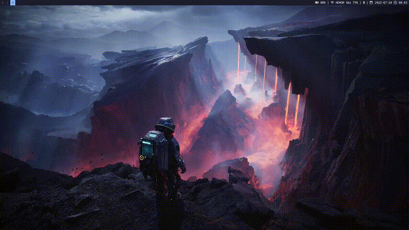

# Phylip dotfiles

This repository contains the custom configuration files for my Arch Linux system, installed completely from scratch, without using archinstall, installation assistants, or any automation scripts.



## Purpose and Technologies

The dotfiles are designed to create a minimalist environment that is efficient and visually appealing.

**Technologies used:**

- `i3` as window manager
- `Alacritty` as terminal emulator
- `Picom` to create effects and visual modifications
- `Fastfetch` to display system information
- `Dunst` to handle notifications
- `Polybar` as customizable status bar
- `Rofi` as application launcher
- `Flameshot` for screenshots
- `Feh` for desktop wallpaper

## Installation

1. Clone or download the repository content:
    ```bash
    git clone https://github.com/Phylip28/dotfiles.git
    ```
    or with SSH
    ```bash
    git clone git@github.com:Phylip28/dotfiles.git
    ```
2. Enter the directory:
    ```bash
    cd dotfiles
    ```
3. Give execution permissions to the installation script:
    ```bash
    chmod +x setup-dotfiles.sh
    ```
4. Execute the script:

    ```bash
    ./setup-dotfiles.sh
    ```

>**Note:** The script will ask if you want to backup your current configurations. You don't need to do it manually. 

## Suggestions

You can fork or suggest improvements to optimize the system, I'm open to new ideas or modifications.
